[TOC]


# 一、项目简介

该系统是一个自主开发的学习项目，基于SpringBoot+MySQL+Redis+RabbitMQ实现的高并发秒杀系统，模拟高并发秒杀过程并进行优化和调整。


# 二、如何模拟秒杀系统

## **1.环境：**

- 1核4G的centos 7的虚拟机
- docker创建一个redis、mysql容器，以及两个SpringBoot项目的容器
- 配置Nginx实现负载均衡以及静态资源存储

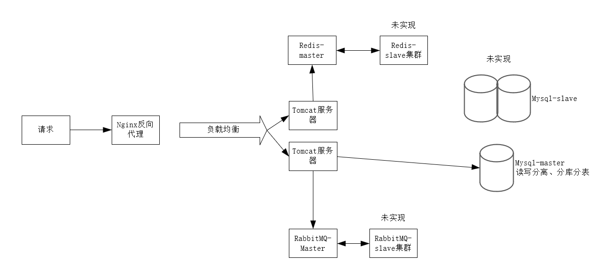

## 2.数据库表设计

##  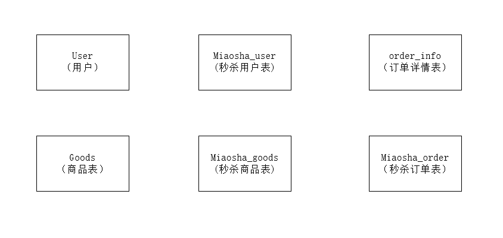

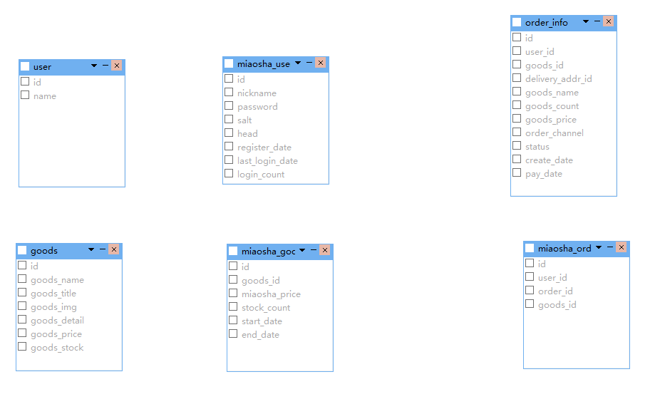

## **3.技术栈：**

SpringBoot+MySQL+Redis+RabbitMQ

## **4.实现步骤：**

- 1.使用UserUtil工具，创建5000个用户(包含用户名、密码)并插入到数据库中
- 2.模拟用户登录，获取对应的token，并将用户名以及token添加到一个txt文本中
- 3.使用JMeter对秒杀接口进行压测（2800（线程数即用户数）*10（轮询））
- 4.生成聚合报告：
  - 响应时间（RT）：系统对请求作出响应的时间
  - **吞吐量（TPS）：系统在单位时间内处理请求的数量**
  - 并发用户数：系统可以同时承载的正常使用系统功能的用户的数量
  - QPS：单个进程每秒请求服务器的成功次数


# 三、基本功能开发

## 1.用户登录

### 1.1.明文密码使用两次MD5处理

1.客户端：PASS=MD5（明文+固定salt）

防止用户密码在网络上明文传输

2.服务端：PASS=MD5（用户输入+随机salt）

现有技术可以直接从数据库中查出密码，再次使用MD5，提高安全性

**为什么要对明文密码做两次md5然后入库？**

第一次防止明文密码直接在网络中传输；第二次则是假如数据库本身被泄露，可以增加被破解的难度，就算被破解一个，还是被一次md5加密后的串，而不是用户的原始密码本身

**两次MD5就安全了吗？**

不是。如果想安全，可以使用https，如果想再安全一点，只能使用浏览器插件比如ActiveX实现。

### 1.2.集成JSR303参数校验（自定义注解实现参数校验）

1.在需要校验的参数前添加@Valid注解

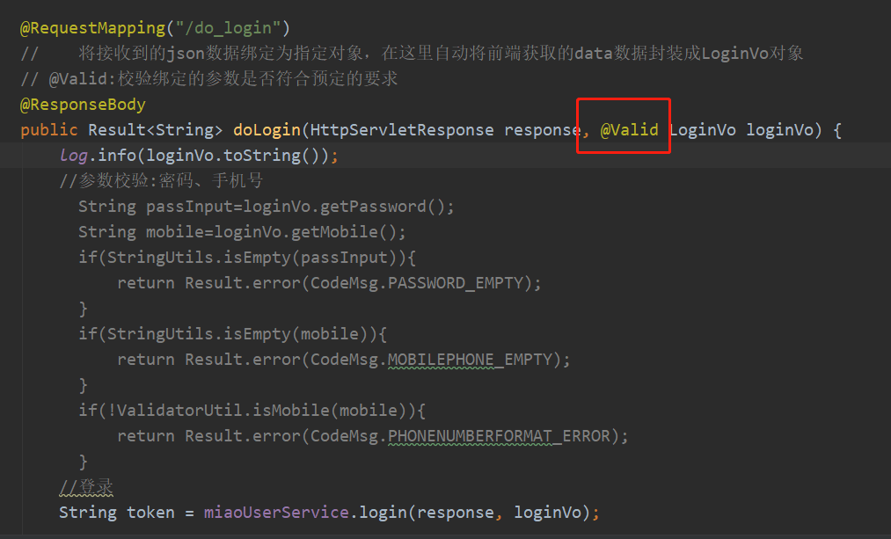

2.在登录参数类中添加注解

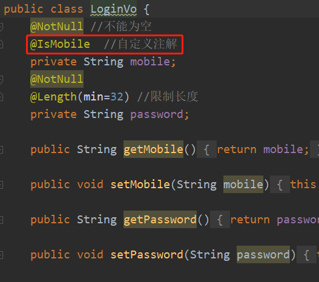

3.自定义注解

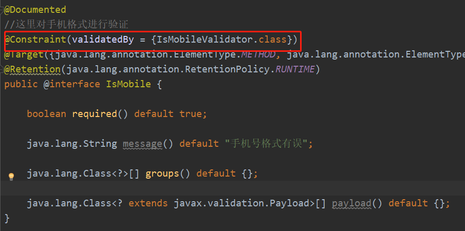

其中使用`@Constraint(validatedBy = {IsMobileValidator.class})`代表处理逻辑的是MyConstraintValidator类

4，在处理逻辑的类中实现`ConstraintValidator<IsMobile,String>`的接口，重写initialize初始化方法以及校验方法isValid方法

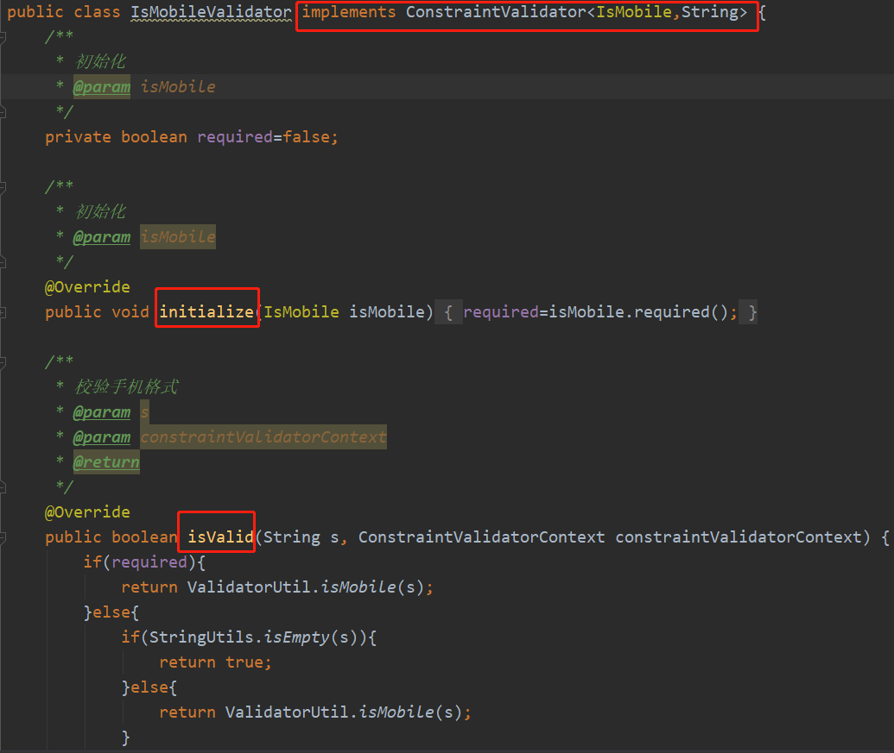

### 1.3.系统通用处理

1.定义GlobleExceptionHandler类，接收抛出的异常，处理异常类

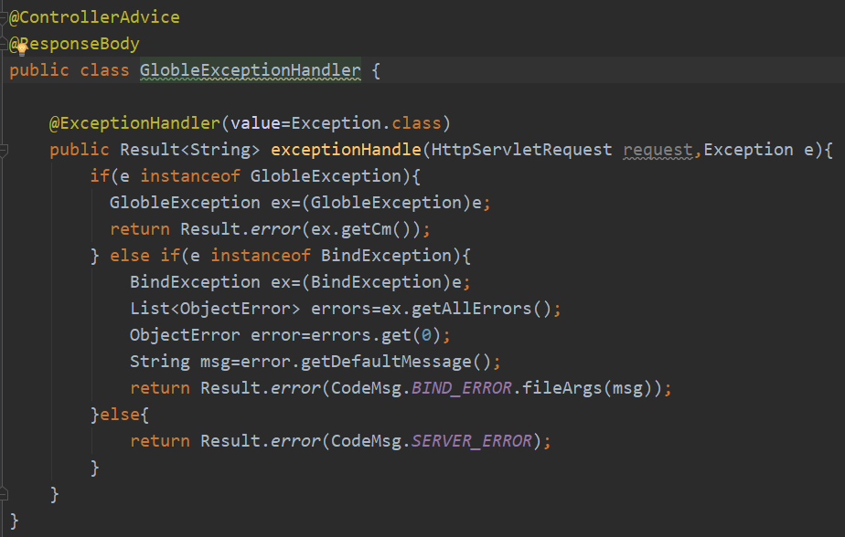

`@ResponseBody:`将方法的返回值以特定的格式写入到response的body区域，进而将数据返回给客户端。如果对象是字符串，直接返回，如果是一个对象，将对象转化未json串，然后写到客户端

`@ControllerAdvice`：springMVC提供的对异常进行统一处理的注解

`@ExceptionHandler：`用于统一处理方法抛出的异常。若添加参数，表明该方法专门用于处理该类异常

### 1.4.基于redis实现分布式session（将token以及用户信息存储到redis中）

1.添加cookie，将token对应的用户信息添加到redis缓存中；创建cookie，将token添加到cookie中，并设置cookie的过期时间，将cookie添加到response响应头中。在登录时，可以将cookie返回到浏览器中

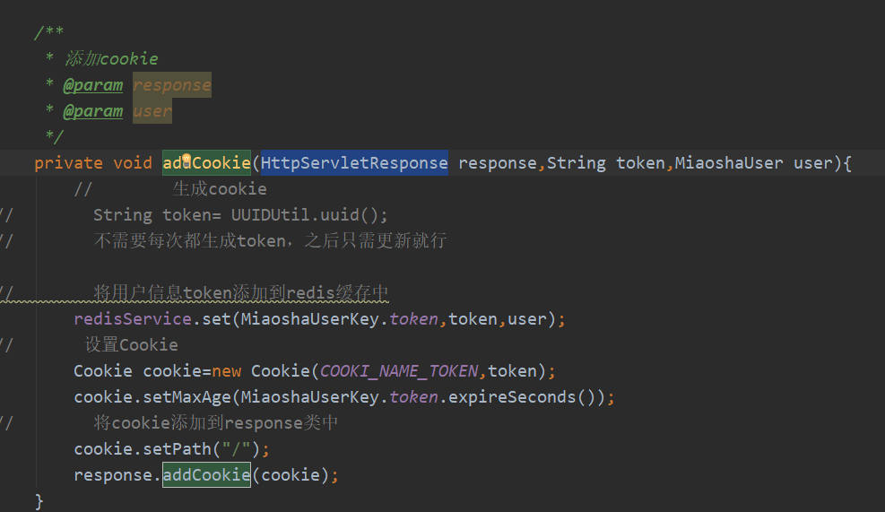

2.在doLogin方法中传入HttpServletResponse参数，用于根据响应头的cookie信息进行登录

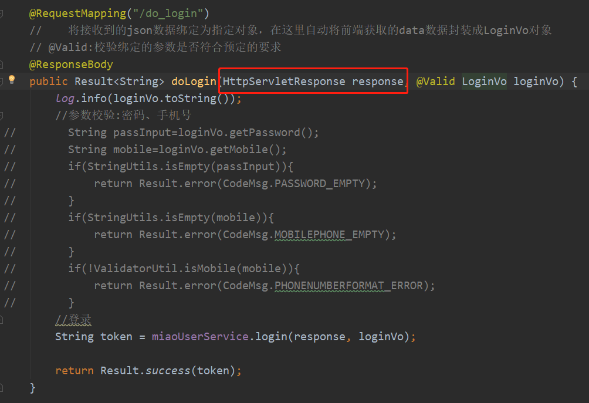

**结果：**

当登录成功进行页面跳转时，会将cookie带入到跳转页面中

**如何刷新cookie时间?**

解决方法：如果redis中存在token，则重新设置cookie

#### 1.4.1.全部配置分布式session

1.创建UserArgumentResolver类，并实现HandlerMethodArgumentResolver接口，重写supportsParameter方法，判断是否为miaoshaUser类；重写resolveArgument方法，刷新token

HandlerMethodArgumentResolver:用于在给定请求的上下文中将方法参数解析为参数值


2，将userArgumentResolver类注入到List<HandlerMethodArgumentResolver>中


- 继承WebMvcConfigurerAdapter类：
  - 是一种Spring内部配置，采用JavaBean的形式事项框架个性化定制
- 重写addArgumentResolvers方法：
  - 将配置注入到指定方法中

#### 1.4.2.无需每次访问都刷新token

登录成功后返回两个token：一个是accesstoken，另一个是refreshtoken，当用户携带accesstoken访问时，不刷新accesstoken，提供一个refreshToken方法，让客户端定义调用，调用时传递refreshToken，更新accesstoken和refreshtoken。这样可以最大限度减少access Token的刷新。

## 2.商品秒杀

优化前

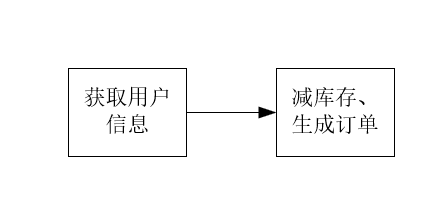

优化后：

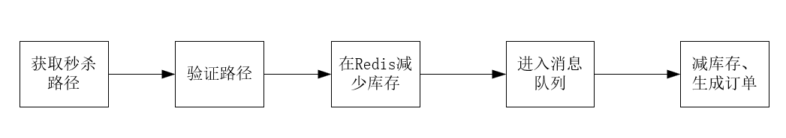

- 添加秒杀路径
- 添加redis预减库存
- 添加rabbitMQ消息队列异步下单

## 3.验证码

思路：点击秒杀之前，先输入验证码，分散用户请求

- 添加生成验证码的接口
- 获取秒杀路径时，验证验证码
- ScriptEngine使用


前端：


后端：


创建验证码后将图片结果放到redis中

# 四、添加Redis优化

## 1.页面缓存

将商品列表页面缓存到redis中，减少服务器压力

```java
 //1.取缓存
        String html = redisService.get(GoodsKey.getGoodsList, "", String.class);
        if(!StringUtils.isEmpty(html)){
            return html;
        }
//        查询商品列表
        List<GoodsVo> goodsList = goodsService.listGoodsVo();
//        做页面展示
        model.addAttribute("goodsList",goodsList);
//        return "goods_list";
        //使用map存储键值对，将值渲染到指定位置
        //SpringBoot2.0之前
//        SpringWebContext ctx=new SpringWebContext(request,response,
//                request.getServletContext(),request.getLocale(),model.asMap(),
//                (org.springframework.context.ApplicationContext) applicationContext);
//        //2.手动渲染，使用ThymeleafViewResolver渲染,参数中需要添加配置或容器，保存着信息
//        html=thymeleafViewResolver.getTemplateEngine().process("goods_list",ctx);
        //SpringBoot2.0之后
        WebContext ctx=new WebContext(request,response,
                request.getServletContext(),request.getLocale(),
                model.asMap());
        html=thymeleafViewResolver.getTemplateEngine().process("goods_list",ctx);

//       添加缓存
        if(!StringUtils.isEmpty(html)){
            redisService.set(GoodsKey.getGoodsList,"",html);
        }
        return html; //这里不会被解析为跳转路径，直接写入HTTP响应正文中
```

使用ThymeleafViewResolver（Thymeleaf视图解析器）进行**手动渲染**，将获取到的html放到缓存中，并返回结果（**其中缓存的html直接写入Http响应正文中**）

**步骤：**

1.取缓存，若有该页面，直接返回

2.手动渲染，将键值对渲染到html静态页面中

3.将页面保存到redis缓存中

**目的：**

减少对Mysql数据库的访问量

## 2.对象缓存

将热点对象数据缓存到redis中

```java
public MiaoshaUser getById(long id){
        //1.取缓存,通过id获取对象
        MiaoshaUser miaoshaUser = redisService.get(MiaoshaUserKey.getById, "" + id, MiaoshaUser.class);
        if(miaoshaUser!=null){
            return miaoshaUser;
        }
        //2.若缓存中没有，从数据库中取
        MiaoshaUser user = miaoshaUserDao.getById(id);
        if(user!=null){
            //3.添加缓存
            redisService.set(MiaoshaUserKey.getById, "" + id, user);
        }
        return user;
    }
```

## 3.预减库存

1.初始化Bean阶段，将Mysql中秒杀商品id、库存存放到redis中

2.每次用户请求，首先访问redis，进行预减库存操作，若redis库存小于0，直接返回秒杀结束。（在这里，可以拦截比较迟的请求，减少mysql数据库的压力）

3.若大于0，则进入mysql，进行减库存、下单操作（后续将使用RabbitMQ进行异步下单优化）

## 4.恶意防刷


```java
String requestURI = request.getRequestURI();
String key=requestURI+"_"+user.getId();
```

redis以requestURI+"_"+user.getId()作为key，并设置过期时间为5秒

**后端：**


**使用拦截器实现通用限流**：

**1.自定义@AccessLimit注解**


**2.创建拦截器**


- 继承HandlerInterceptorAdapter接口
- 重写preHandle方法
  - 将用户放到ThreadLocal中
  - 扫描方法，获取AccessLimit注解，并获取注解中属性
  - 实现防刷逻辑代码
- 使用ThreadLocal存储用户，**保证只有指定线程得到存储数据**

## 5.地址掩藏

思路：秒杀开始前，先去请求接口获取秒杀地址

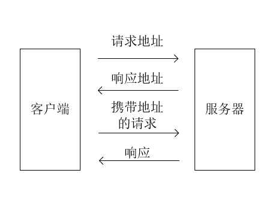

**为什么要做秒杀地址的隐藏？**

防止在秒杀开始前有人开发刷接口的工具，频繁刷新

步骤：

点击秒杀按钮，先向服务器请求秒杀地址

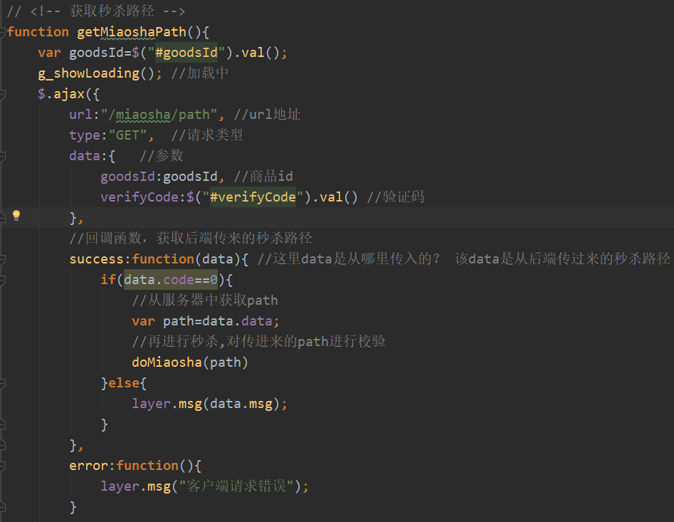

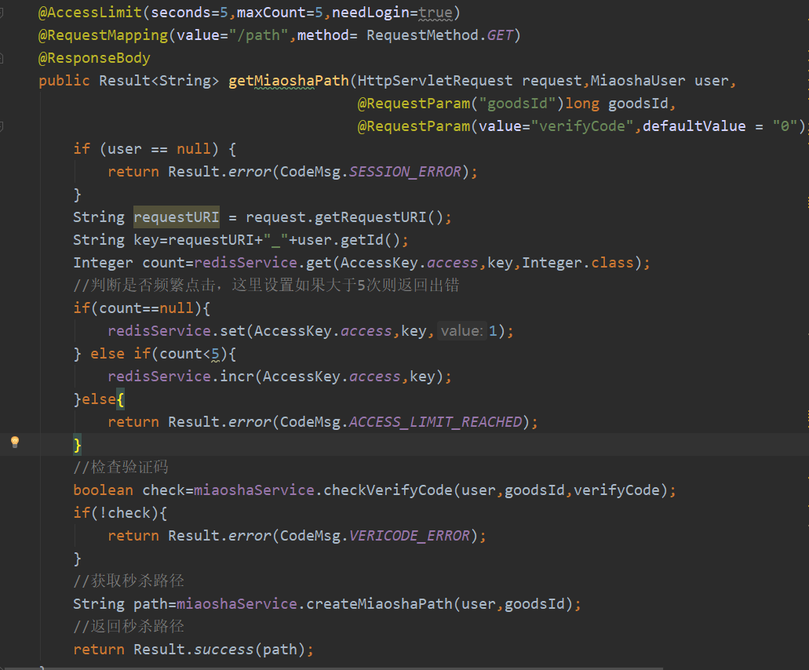

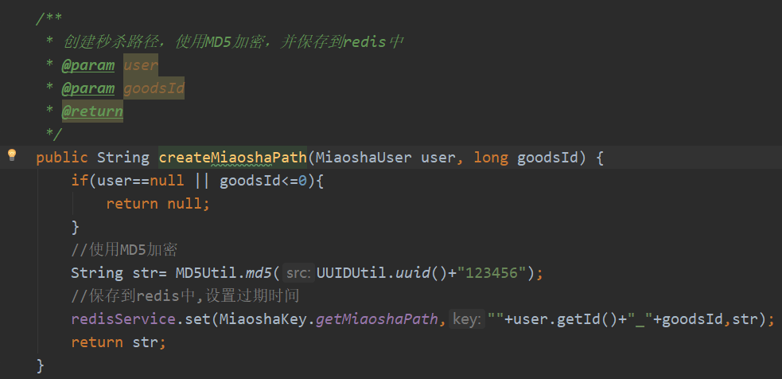

创建秒杀路径，使用MD5加密，并保存到redis中


# 五、添加RabbitMQ优化

## 1.异步下单

**主要作用：**

用来保护db防止被瞬间大并发压垮，请求先入队，然后再去访问db。如果不这样做，请求就直接去访问db了。

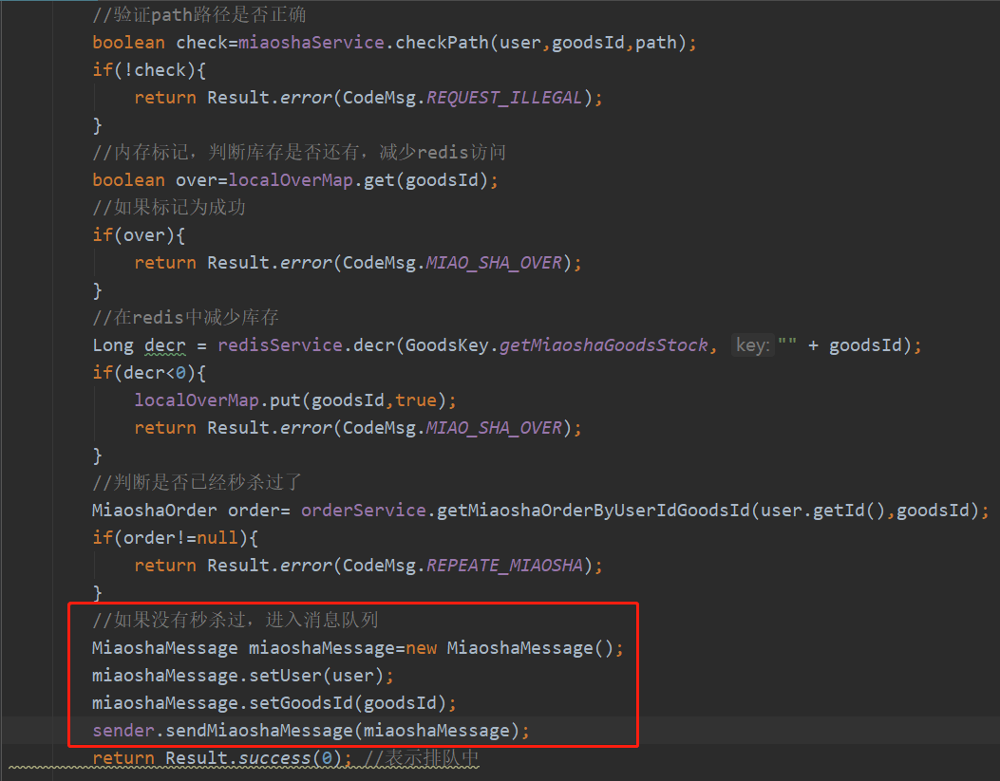

步骤：

1.在前一步Redis预减库存后，不直接进入mysql数据库，而是进入消息队列

2.配置消息队列，**可以设置消费者并发数以及每次消费者从队列中获取的消息数量**，所以**同样可以减少mysql数据库的压力**

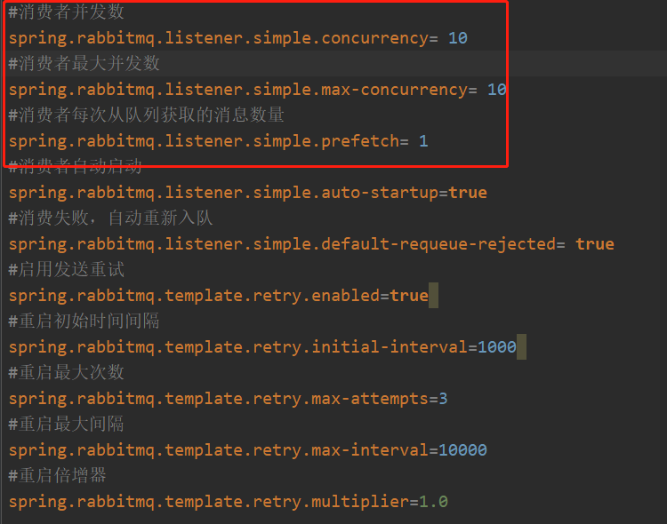

3.监听队列，从队列中获取消息，进行后续操作（判断库存、判断是否以秒杀、减库存、下订单、写入秒杀订单）

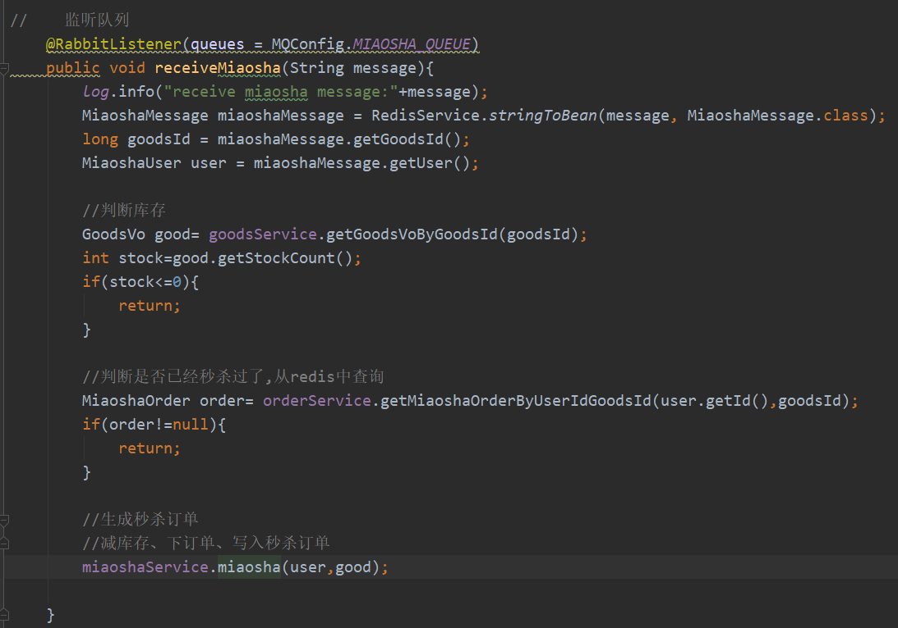


减库存、下订单、写入秒杀订单是一个原子操作，如果秒杀成功，则**返回秒杀订单号**

4.在此期间，客户端一直处于轮询状态，如果返回订单号，则秒杀成功

# 六、Docker部署

## 1.Nginx

### 1.1.反向代理配置

```
#反向代理服务器集群
    upstream tomcatserver{
        server localhost:8080 weight=1 max_fails=2 fail_timeout=30s; # 设置权重，最大是失败数以及失败超时时间
        server localhost:8081 weight=1 max_fails=2 fail_timeout=30s;
        keepalive 200; # 最大的空闲的长连接数
    }
    
server {
        listen       9090;
        server_name  localhost 10.1.18.43;

        location / {
            proxy_pass http://tomcatserver; 
        }
```

-  proxy_pass http://tomcatserver; :指代理后转发路径。如果后面不加/，该proxy_pass替换请求url的ip和端口；如果添加/，该proxy_pass+请求url匹配的location路径后的内容

### 1.2.缓存配置

1.添加缓存目录

```
proxy_cache_path /usr/local/nginx/proxy_cache levels=1:2 keys_zone=nuget-cache:200m inactive=1d max_size=20g; # 缓存存储目录
```

- keys_zone:缓存空间名称

- max_size:缓存文件可占用的最大空间

- inactive：一个缓存多长时间不被访问，就会被删除

2.在server设置部分添加proxy_cache和proxy_cache_valid设置

```
server {
        listen       9090;
        server_name  localhost 10.1.18.43;

        location / {
            proxy_cache nuget-cache; #设置为key_zone中的值，记缓存空间名称
            proxy_cache_valid 24h; #设置为缓存过期时间
            proxy_ignore_headers Set-Cookie Cache-Control;
            proxy_hide_header Cache-Control;
            proxy_hide_header Set-Cookie;
        }
```

- proxy_cache nuget-cache; #设置为key_zone中的值，记缓存空间名称
- proxy_cache_valid 24h; #设置为缓存过期时间
- proxy_ignore_headers：忽略请求头中Cache-Control
- proxy_hide_header:隐藏Cache-Control字段
- Proxy_hide_header:隐藏Set-Cookie字段

3.静态文件加缓存

```
location ~ .*\.(gif|jpg|jpeg|png|bmp|swf|js|css|ico|html|htm)?$
        {
            expires 1d;  #到期时间
            proxy_cache nuget-cache; # 缓存空间名
            proxy_cache_valid 200 304 1d; #缓存有效
            proxy_cache_valid any 1m;
            proxy_cache_key $host$uri$is_args$args;
            proxy_pass http://tomcatserver;
        }
```

# 七、JMeter压测

## **1.压测结果：**

在未进行优化前，结果如下：

| 线程数（用户数） | 循环数 | 错误率 | Throughput |
| ---------------- | ------ | ------ | ---------- |
| 5000             | 10     | 43.54% | 1005.1     |
| 3000             | 10     | 5.89%  | 837.77     |
| 2900             | 10     | 2.65%  | 1100.7     |
| 2800             | 10     | 0.00%  | 1762.3     |
| 2500             | 10     | 0.00%  | 1113.8     |
| 1000             | 10     | 0.00%  | 1684.6     |

由图可知，超过2800*10，其就会出现错误，所以使用2800*10的数据

| 线程数（用户数） | 循环数 | 错误率 | Throughput |
| ---------------- | ------ | ------ | ---------- |
| 5000             | 10     |        |            |
| 3000             | 10     | 5.89%  | 1474.1     |
| 2900             | 10     | 2.65%  | 1706.0     |
| 2800             | 10     | 0.00%  | 1171.3     |
| 2500             | 10     |        |            |
| 1000             | 10     |        |            |

测试10次2800*10

| 编号 | 线程数（用户数） | 循环数 | 错误率 | Throughput |
| ---- | ---------------- | ------ | ------ | ---------- |
| 1    | 2800             | 10     | 0.00%  | 1762.3     |
| 2    | 2800             | 10     | 0.00%  | 1171.3     |
| 3    | 2800             | 10     | 0.00%  | 1840.5     |
| 4    | 2800             | 10     | 0.00%  | 1836.8     |
| 5    | 2800             | 10     | 14.41% | 1038.20    |
| 6    | 2800             | 10     | 0.00%  | 1729.0     |
| 7    | 2800             | 10     | 0.00%  | 1763.8     |
| 8    | 2800             | 10     | 0.00%  | 1816.1     |
| 9    | 2800             | 10     | 0.00%  | 1825.7     |
| 10   | 2800             | 10     | 20.70% | 1273.0     |
| 11   | 2800             | 10     | 0.00%  | 1751.4     |

平均值：1721.88（除去两次错误情况）

添加Redis以及RabbitMQ优化后：

| 编号 | 线程数（用户数） | 循环数 | 错误率 | Throughput |
| ---- | ---------------- | ------ | ------ | ---------- |
| 1    | 2800             | 10     | 0.00%  | 8013.7     |
| 2    | 2800             | 10     | 0.00%  | 7524.9     |

平均值：7769.3

# 八、常见问题

## 1.Redis库存值和Mysql库存值保持一致？

(1)redis不是库存，作用只是为了阻挡多余请求穿透到DB，不需要保持一致

解决方案：redis数量设置多于db库存数量，保证库存尽可能为0

(2)如果一定要使Redis库存值和Mysql库存值保持一致

当下单失败时，执行一个redis的Lua脚本，该脚本具有原子性，实现redis中库存回增。（同样的在预减库存操作也可以使用Lua脚本实现，避免在高并发场景下，出现redis库存为负）

## 2.如果用户秒杀成功，但没有付款？

将库存加回去

在创建订单时，将订单写到延迟队列中，如果在指定时间内付款，则删除，否则，将延迟队列中的订单出队，再查询订单状态，如果未支付，则进行回仓重置redis（Lua脚本）和mysql数据（事务），以及一些秒杀结束的标志等。

## 3.Redis由于网络延迟导致的数据不一致怎么解决？

- 使用Lua脚本实现原子操作
- 使用redis分布式锁（setnx：加锁就是存在该key，如果不存在才可以获取该数据），如果卡死，可以使用分段分布式锁（将库存放到多个地方存储，比如500个库存，可以分5个100分别以key1，key2.....、key5存储）。

## 4.超卖问题

两种情况：（1）一个用户同时发出多个请求，如果库存足够，用户可以下多个订单；（2）减库存sql上没有加库存数量的判断，并发时导致库存减成负数

1.数据库添加唯一索引，防止用户重复购买

2.SQL加库存判断：防止库存变成负数

使用数据库中特有的锁，减少前判断是否大于0

**一个用户下多个订单：**

前端：
添加验证码，防止用户同时发出多个请求；

后端：

添加唯一索引，确保一个用户只能生成一个订单，一个用户id对应一个商品id


## 5.Redis预减成功，DB扣减库存失败怎么办？

- 第一种情况，一个用户发出多个请求，并且都秒杀到了，由于一个用户只能下一单，就会出现redis预减成功，而下单只成功一次的情况
- 第二种情况，用户在生成订单时出现错误，也会导致redis预减成功而DB扣减失败的情况

所以，在初始化时，**redis数量可以多余db库存数量**

**后果：**

对用户而言，没买到是正常的；

对商户而言，没卖出也不亏；

对网站而言，没投诉就可以

卖不完是完全允许的，但卖超是绝对不允许的。卖超需要网站自己出


# 九、后续优化

## 1.Redis集群

由于加入redis进行预减库存操作，所以目前主要的性能瓶颈在redis上，所以可以搭建Redis集群

待续。。。。。

## 2.Nginx反向代理多个服务器

目前Nginx反向代理只代理两个应用服务器，要想加大并发量，可以添加多个应用服务器，减少每个服务器的负载 


